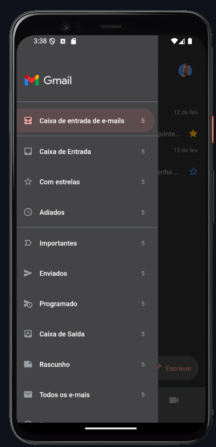

# Delivery App

This is a gmail clone application, made to study the structures of react native for mobiles.


Project images: 
<div align="center">
   
   
</div>

## Technologies Used

- **React Native** - Framework principal para desenvolvimento mobile
- **Typescript** - Linguagem de programação utilizada


## Instalation

For execute the project local, follow the steps bellow

1. Clone this repository:
   ```bash
   git clone https://github.com/gabrielhdsalves/Gmail-App-Mobile.git
   ```
2. Enter the cloned directory
   ```bash
      cd Gmail-App-Mobile
   ```
3. Install the dependencies
   ```bash
     npm install
   ```
4. Start the front
   ```bash
      npx expo start
   ```

Credits to <a href="https://github.com/orodrigogo">Rodrigo Gonçalves</a> for the excellent video